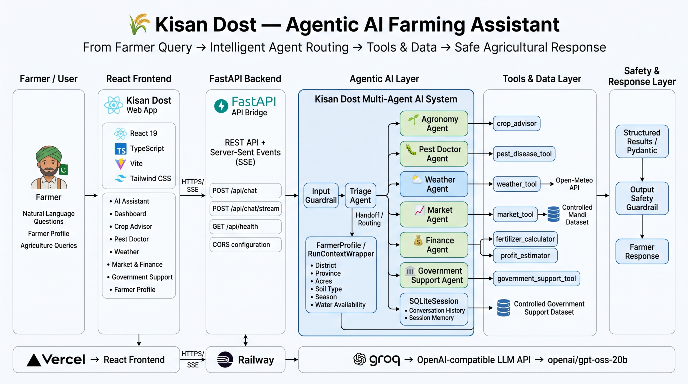
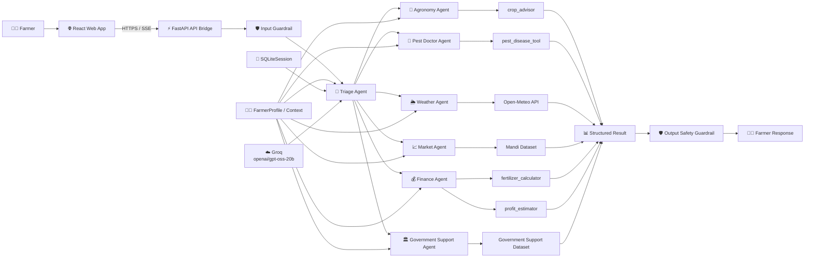

<div align="center">

# 🌾 Kisan Dost

### An Agentic AI Farming Assistant for Pakistani Farmers

*Understand the farmer. Route intelligently. Use reliable tools. Respond safely.*

[](https://kisan-dost-alpha.vercel.app)
[](https://kisan-dost-production.up.railway.app)
[](https://github.com/AhmadIshaq-code/kisan-dost)


</div>

---

**Kisan Dost** is a multi-agent **Agentic AI agricultural assistant** designed to help Pakistani farmers make better farming decisions through natural-language interaction — in Urdu, Roman Urdu, or English.

Instead of relying on a single chatbot, Kisan Dost uses a **Triage Agent** to understand the farmer's intent and intelligently route each request to a specialized agricultural agent. Every specialist can call dedicated **function tools, controlled datasets, external APIs, deterministic calculations, farmer context, session memory, and safety guardrails** to produce practical and safer responses.

> **Understand → Route → Specialize → Use Tools → Structure → Validate → Respond**

---

## 📑 Table of Contents

- [The Problem](#-problem)
- [The Solution](#-solution)
- [System Architecture](#️-system-architecture)
- [What Kisan Dost Can Do](#-what-kisan-dost-can-do)
- [Agent Architecture](#-agent-architecture)
- [Function Tools](#-function-tools)
- [Farmer Context](#-farmer-context)
- [Session Memory](#-session-memory)
- [Guardrails & Safety](#️-guardrails--safety)
- [Structured Outputs](#-structured-outputs)
- [Real-Time Streaming](#-real-time-streaming)
- [API Endpoints](#-api-endpoints)
- [Technology Stack](#️-technology-stack)
- [Project Structure](#-project-structure)
- [Local Installation](#-local-installation)
- [Production Deployment](#️-production-deployment)
- [Demo Videos](#-demo-videos)
- [Example Workflow](#-example-workflow)
- [OpenAI Agents SDK Concepts](#-openai-agents-sdk-concepts-demonstrated)
- [Testing Checklist](#-testing-checklist)
- [Current Limitations](#️-current-limitations)
- [Future Roadmap](#-future-roadmap)
- [Security](#-security)
- [Project Philosophy](#-project-philosophy)
- [Project Status](#-project-status)

---

## 🎯 Problem

Farmers often need information from multiple agricultural domains at the same time. A single farming decision may involve:

- Crop selection
- Soil and water availability
- Fertilizer requirements
- Weather conditions
- Pest and disease identification
- Mandi (market) prices
- Farming costs
- Expected profit
- Government support programs

A traditional chatbot architecture usually looks like this:

```text
Farmer → LLM → Answer
```

This makes it difficult to separate responsibilities, perform reliable calculations, control sensitive outputs, integrate specialized tools, and maintain trusted farmer information.

---

## 💡 Solution

Kisan Dost uses a **multi-agent architecture** where different agricultural responsibilities are handled by specialized agents, connected through the Triage Agent's **handoffs**:

```text
Farmer
   ↓
React Web App
   ↓
FastAPI API Bridge
   ↓
Input Guardrail
   ↓
Triage Agent
   ↓
Specialist Agent
   ↓
Function Tool / API / Controlled Data
   ↓
Structured Result
   ↓
Output Safety Guardrail
   ↓
Farmer Response
```

**Example routing:**

```text
"Rabi mein kaunsi crop lagaoon?"
        ↓
   Triage Agent
        ↓
  Agronomy Agent
        ↓
   crop_advisor
        ↓
Crop Recommendation
```

---

## 🏗️ System Architecture

<div align="center">



*End-to-end flow: Farmer → React Frontend → FastAPI Backend → Agentic AI Layer → Tools & Data Layer → Safety & Response Layer*

</div>

<br/>

<details>
<summary><strong>Mermaid diagram (source view)</strong></summary>



</details>

### Deployment Architecture

```text
                  🌐 Internet
                       │
                       ▼
        ┌───────────────────────────┐
        │          Vercel           │
        │   React + TypeScript UI   │
        └─────────────┬─────────────┘
                       │
                  HTTPS / SSE
                       │
                       ▼
        ┌───────────────────────────┐
        │          Railway          │
        │      FastAPI Backend      │
        └─────────────┬─────────────┘
                       │
                       ▼
        ┌───────────────────────────┐
        │           Groq            │
        │       GPT-OSS-20B         │
        │  OpenAI-Compatible API    │
        └───────────────────────────┘
```

---

## ✨ What Kisan Dost Can Do

| | Capability |
|---|---|
| 🌱 | **Crop Recommendation** — season, district, soil & water aware |
| 🐛 | **Pest & Disease Diagnosis** — symptom-based analysis |
| 🧪 | **Fertilizer Calculation** — deterministic cost & quantity |
| 🌦️ | **Weather & Irrigation Information** — live via Open-Meteo |
| 📈 | **Mandi Price Lookup** — controlled/demo market data |
| 💰 | **Profit & Break-Even Estimation** — revenue, cost, net profit |
| 🏛️ | **Government Agricultural Support** — province/eligibility aware |
| 👨‍🌾 | **Farmer Profile Context** — remembers who you are |
| 💾 | **Conversation Session Memory** — multi-turn conversations |
| 🛡️ | **Input & Output Safety Guardrails** — keeps responses safe |
| ⚡ | **Real-Time Streaming AI Responses** — via Server-Sent Events |

---

## 🤖 Agent Architecture

### 1. Triage Agent

**Purpose:** the central routing agent.

**Responsibilities:**
- Understand farmer intent
- Classify the request
- Route the request to the appropriate specialist
- Perform agent handoffs
- Handle clearly unrelated requests safely

```text
Farmer: "Meri cotton mein yellow spots hain"
        ↓
   Triage Agent
        ↓
 Pest Doctor Agent
```

The Triage Agent itself does not perform specialist calculations or directly execute specialist tools.

### 2. 🌱 Agronomy Agent

**Purpose:** agricultural and crop recommendations.

**Capabilities:** crop recommendation, season-based recommendations, district-aware recommendations, soil-aware recommendations, water-availability considerations.

**Tool:** `crop_advisor`

```text
Farmer: "Rabi mein Faisalabad ke liye crop recommend karo"
        ↓
  Agronomy Agent
        ↓
   crop_advisor
        ↓
Recommended Crops
```

### 3. 🐛 Pest Doctor Agent

**Purpose:** analyzes farmer-provided symptoms and identifies possible crop pests or diseases.

**Capabilities:** pest/disease identification, symptom analysis, treatment guidance, agricultural safety guidance.

**Tool:** `pest_disease_tool`

> The system intentionally avoids inventing pesticide dosages when verified dosage information is unavailable.

### 4. 🌦️ Weather Agent

**Purpose:** provides weather information using an external weather API.

**External API:** [Open-Meteo](https://open-meteo.com/)

Retrieves: temperature, humidity, wind speed, precipitation, daily max/min temperature, precipitation probability — sourced externally rather than generated from the LLM's own knowledge.

### 5. 📈 Market Agent

**Purpose:** provides mandi price information.

**Tool:** `market_tool`

Supports demo pricing for: Wheat, Chickpea, Maize, Cotton.

> Mandi prices in the current implementation are demo/controlled values and should not be treated as guaranteed live market prices.

### 6. 💰 Finance Agent

**Purpose:** handles deterministic farming calculations.

**Tools:** `fertilizer_calculator`, `profit_estimator`

- **Fertilizer Calculator** — bags per acre, total bags, price per bag, total fertilizer cost (currently DAP, Urea).
- **Profit Estimator** — expected revenue, farming cost, net profit, profit per acre, break-even info where supported.

Calculations are performed using deterministic application logic instead of asking the LLM to do the math itself.

### 7. 🏛️ Government Support Agent

**Purpose:** helps farmers discover relevant agricultural support programs.

**Tool:** `government_support_tool`

Considers: province, support requirement, program type, eligibility information, benefits.

> The current implementation uses controlled/demo government-support data and should be verified against official sources before real-world decisions.

---

## 🧩 Function Tools

| Tool | Agent | Purpose |
|---|---|---|
| `crop_advisor` | Agronomy | Recommend suitable crops |
| `pest_disease_tool` | Pest Doctor | Diagnose possible pests/diseases |
| `weather_tool` | Weather | Retrieve weather information |
| `market_tool` | Market | Lookup mandi prices |
| `fertilizer_calculator` | Finance | Calculate fertilizer requirements and costs |
| `profit_estimator` | Finance | Estimate farming revenue, cost and profit |
| `government_support_tool` | Government Support | Find agricultural support programs |

---

## 👨‍🌾 Farmer Context

Kisan Dost uses **`RunContextWrapper`** to give agents and tools access to trusted farmer information — so tools don't need to repeatedly ask the farmer for the same details.

```python
FarmerProfile(
    name="Ahmad",
    district="Faisalabad",
    province="Punjab",
    acres=5,
    soil_type="loamy",
    season="Rabi",
    water_availability="limited",
)
```

```text
Farmer Profile
      │
      ├── District
      ├── Province
      ├── Acres
      ├── Soil Type
      ├── Season
      └── Water Availability
```

---

## 💾 Session Memory

Kisan Dost uses **`SQLiteSession`** to maintain conversation history across turns, so follow-up questions don't need to repeat context:

```text
Farmer: "Rabi mein crop recommend karo"
        ↓
  Agronomy Agent → Chickpea recommended
        ↓
Farmer: "Is crop ka fertilizer kitna chahiye?"
```

**Context vs. Session — an important distinction:**

```text
RunContextWrapper  →  Trusted Farmer Information
SQLiteSession       →  Conversation History
```

---

## 🛡️ Guardrails & Safety

### Input Guardrail
Checks the latest farmer request and prevents clearly unrelated queries from entering the agricultural workflow.

```text
✅ "Meri wheat mein pest hai"
✅ "Fertilizer ka cost kitna hoga?"
❌ "Mujhe Python sikhao"
```

### Output Safety Guardrail
Validates generated responses before they're returned to the farmer, with protections around:

| Area | Protection |
|---|---|
| 🧪 Pesticide Safety | Never invents exact dosages; directs farmers to product labels and qualified professionals |
| 🏥 Human Medical Advice | The assistant does not provide human medical advice |
| 🏛️ Government Benefits | Never guarantees subsidy or program approval |
| 💰 Financial Data | Figures are validated against controlled data and deterministic calculations |

---

## 📊 Structured Outputs

Kisan Dost uses **Pydantic** models for structured, predictable data:

```python
class CropRecommendation(BaseModel):
    crop_name: str
    suitability_score: float
    season: str
    water_requirement: str
    expected_yield: str
    market_demand: str
    government_support: Optional[str]
```

**Benefits:** type safety, validation, predictable responses, API-friendly data, consistent frontend rendering.

---

## ⚡ Real-Time Streaming

The web app streams responses using **Server-Sent Events (SSE)**, connecting to:

```text
POST /api/chat/stream
```

The backend streams events: `agent`, `tool`, `delta`, `done`, `error` — so the UI can show agent activity, tool execution, progressive response generation, completion state, and errors in real time instead of waiting for the full answer.

---

## 🌐 API Endpoints

| Method | Endpoint | Purpose |
|---|---|---|
| `GET` | `/api/health` | Backend health check |
| `POST` | `/api/chat` | Standard AI chat |
| `POST` | `/api/chat/stream` | Streaming AI chat via SSE |

---

## 🛠️ Technology Stack

| Component | Technology |
|---|---|
| Frontend | React 19 |
| Language | TypeScript |
| Build Tool | Vite |
| Styling | Tailwind CSS v4 |
| Backend | FastAPI |
| AI Framework | OpenAI Agents SDK |
| Model Provider | Groq |
| Model | `openai/gpt-oss-20b` |
| API Protocol | REST + SSE |
| Data Validation | Pydantic |
| Session Memory | SQLiteSession |
| Weather | Open-Meteo |
| Frontend Deployment | Vercel |
| Backend Deployment | Railway |
| Version Control | Git + GitHub |

---

## 📁 Project Structure

```text
kisan-dost/
│
├── app_agents/
│   ├── triage.py
│   ├── agronomy.py
│   ├── pest_doctor.py
│   ├── weather.py
│   ├── market.py
│   ├── finance.py
│   └── govt_support.py
│
├── guardrails/
│   ├── input_guardrail.py
│   └── output_guardrail.py
│
├── data/
│   └── controlled agricultural datasets
│
├── Frontend_app/
│   ├── src/
│   │   ├── components/
│   │   ├── types.ts
│   │   └── ...
│   ├── package.json
│   ├── vite.config.ts
│   └── vercel.json
│
├── api.py
├── main.py
├── requirements.txt
├── .env.example
├── .gitignore
└── README.md
```

---

## 🚀 Local Installation

### Prerequisites

- Python 3.10+
- Node.js
- npm
- Git

### 1. Clone Repository

```bash
git clone https://github.com/AhmadIshaq-code/kisan-dost.git
cd kisan-dost
```

### 2. Backend Setup

Create a virtual environment:

```bash
python -m venv .venv
```

**Windows**
```bash
.venv\Scripts\activate
```

**Linux / macOS**
```bash
source .venv/bin/activate
```

Install Python dependencies:

```bash
pip install -r requirements.txt
```

### 3. Configure Environment Variables

Create `.env` from `.env.example`:

```env
LLM_PROVIDER=groq
GROQ_API_KEY=your_groq_api_key
GROQ_MODEL=openai/gpt-oss-20b
```

⚠️ Never commit your real API key.

### 4. Run Backend

```bash
uvicorn api:app --host 0.0.0.0 --port 8000
```

- Backend: `http://localhost:8000`
- Health check: `http://localhost:8000/api/health`

### 5. Run Frontend

```bash
cd Frontend_app
npm install
```

Create a frontend environment variable if needed:

```env
VITE_API_BASE_URL=http://localhost:8000
```

Run the dev server:

```bash
npm run dev
```

The Vite development server will print the local frontend URL.

---

## ☁️ Production Deployment

Kisan Dost uses a separated frontend/backend deployment architecture.

```text
Frontend:  React + Vite → Vercel
Backend:   FastAPI → Railway
AI Model:  Railway Backend → Groq API → openai/gpt-oss-20b
```

**Production flow:**

```text
Farmer → Vercel → HTTPS/SSE → Railway → FastAPI → Kisan Dost Agentic AI → Groq
```

The Groq API key remains server-side and is **never exposed to the frontend**.

---

## 🎥 Demo Videos

- 🎬 **[Full Agentic AI Project Demo](https://drive.google.com/file/d/1-62ahWog5dlVFlNfrxHPzon-UlQXH6kZ/view?usp=sharing)** — multi-agent architecture, Triage Agent, specialist agents, handoffs, function tools, context, session memory, guardrails, agricultural workflows.
- 🖥️ **[Frontend Demo](https://drive.google.com/file/d/10IjYVs4HO-IScISIAGfHAkh4YYkkncH6/view?usp=sharing)** — dashboard, AI assistant, agent activity, crop advisor, pest doctor, weather, market & finance, government support, farmer profile.

---

## 🔄 Example Workflow

**Scenario:** `"Rabi mein Faisalabad mein kaunsi crop lagaoon?"`

| Step | What happens |
|---|---|
| 1. Input Guardrail | Agricultural request → Allowed ✅ |
| 2. Triage | Crop Recommendation Intent → routed to Agronomy Agent |
| 3. Tool Execution | Agronomy Agent calls `crop_advisor` |
| 4. Structured Result | Crop, Suitability, Water Requirement, Expected Yield, Market Demand |
| 5. Output Safety | Structured Result → Output Guardrail → Validated Response |
| 6. Farmer Response | *"Chickpea is a suitable option for your current Rabi conditions..."* |

---

## 🤖 OpenAI Agents SDK Concepts Demonstrated

| Concept | Usage |
|---|---|
| `Agent` | Creates Triage and specialist agents |
| `Runner` | Executes agent workflows |
| `Function Tools` | Connects agents with Python functions |
| `Handoffs` | Routes requests between agents |
| `RunContextWrapper` | Provides trusted farmer context |
| `SQLiteSession` | Maintains conversation history |
| `Input Guardrails` | Restricts unrelated requests |
| `Output Guardrails` | Validates final responses |
| `Pydantic` | Structured data validation |
| `ModelSettings` | Model behavior configuration |

---

## 🧪 Testing Checklist

<details>
<summary><strong>Input Guardrail</strong></summary>

- [x] Agriculture query allowed
- [x] Crop query allowed
- [x] Fertilizer query allowed
- [x] Weather query allowed
- [x] Subsidy query allowed
- [x] Unrelated query blocked
- [x] Roman Urdu agriculture queries supported
</details>

<details>
<summary><strong>Agent Routing</strong></summary>

- [x] Crop → Agronomy
- [x] Weather → Weather
- [x] Pest → Pest Doctor
- [x] Mandi → Market
- [x] Fertilizer → Finance
- [x] Profit → Finance
- [x] Subsidy → Government Support
</details>

<details>
<summary><strong>Tools</strong></summary>

- [x] Crop Advisor
- [x] Fertilizer Calculator
- [x] Profit Estimator
- [x] Open-Meteo Weather
- [x] Mandi Lookup
- [x] Pest/Disease Diagnosis
- [x] Government Support
</details>

<details>
<summary><strong>Safety</strong></summary>

- [x] Pesticide dosage protection
- [x] Human medical advice protection
- [x] Unsupported currency protection
- [x] Guaranteed subsidy protection
</details>

<details>
<summary><strong>Production</strong></summary>

- [x] FastAPI backend deployed
- [x] React frontend deployed
- [x] SSE streaming
- [x] Production CORS configuration
- [x] Environment-based API URL
- [x] Secrets kept server-side
- [x] Health endpoint
- [x] SPA routing configuration
</details>

---

## ⚠️ Current Limitations

Kisan Dost is currently a **functional prototype**. Current limitations include:

- Controlled agricultural datasets
- Controlled/demo mandi prices
- Controlled/demo government-support information
- Limited crop and pest datasets
- Weather depends on an external API
- SQLite session storage is suitable for the current prototype but not ideal for large-scale production
- No full production authentication system
- Agricultural recommendations should not replace qualified agricultural experts
- Government and market information should be independently verified before important financial decisions

---

## 🚀 Future Roadmap

**🌐 User Experience**
- Urdu-first interface
- Improved mobile experience
- Progressive Web App
- Offline-friendly farmer workflows

**🎙️ Multimodal Interaction**
- Voice-based farmer assistant
- Urdu speech recognition
- Text-to-speech
- Image-based crop diagnosis
- Crop disease image analysis

**📊 Agricultural Intelligence**
- Larger agricultural knowledge base
- Soil analysis
- Historical farming analytics
- Satellite data
- Advanced weather intelligence
- Personalized farming recommendations

**📈 Live Agricultural Data**
- Live mandi prices
- Official government-program integrations
- Real-time agricultural alerts
- Market intelligence

**👨‍🌾 Expert Escalation**
- Escalating complex cases to qualified agricultural officers or experts

**🏭 Production Infrastructure**
- Production database
- Authentication and authorization
- Monitoring & advanced observability
- Scalable infrastructure
- Notification services
- Improved data governance

---

## 🔐 Security

- API credentials are stored in environment variables
- `.env` is excluded from version control
- API keys are never hard-coded
- `.env.example` contains placeholders only
- Backend secrets are never exposed to the React frontend
- Tool inputs are validated
- Deterministic calculations are handled by application logic
- Guardrails validate sensitive responses
- CORS is explicitly configured for the production frontend

---

## 🧠 Project Philosophy

> **Let the AI understand the farmer. Let specialized agents handle the domain. Let tools handle the facts and calculations. Let guardrails protect the response.**

```text
Understand → Route → Specialize → Use Tools → Structure → Validate → Respond
```

This demonstrates how Agentic AI can move beyond a basic question-answer chatbot toward a system capable of coordinating multiple specialized capabilities.

### 🌾 Why Kisan Dost?

Agriculture is a domain where decisions directly affect crop production, farming expenses, water usage, pest management, market decisions, and farmer income. Kisan Dost brings multiple agricultural workflows together through a single natural-language interface — combining multi-agent architecture, agent handoffs, function tools, external APIs, deterministic calculations, structured outputs, farmer context, session memory, input/output guardrails, real-time SSE streaming, and production deployment into one practical **Agentic AI agricultural assistant**.

---

## 📌 Project Status

| | |
|---|---|
| **Status** | Functional Web-Based Agentic AI Prototype |
| **Interface** | React Web Application |
| **Backend** | FastAPI |
| **Primary Language** | Python + TypeScript |
| **Architecture** | Multi-Agent Agentic AI |
| **Model Provider** | Groq |
| **Model** | `openai/gpt-oss-20b` |
| **Agent Framework** | OpenAI Agents SDK |
| **Frontend Deployment** | Vercel |
| **Backend Deployment** | Railway |
| **Domain** | Agriculture / AgriTech |
| **Target Users** | Pakistani Farmers |

---

<div align="center">

### 🌱 Kisan Dost
**Understand the farmer. Route intelligently. Use reliable tools. Respond safely.**

</div>
