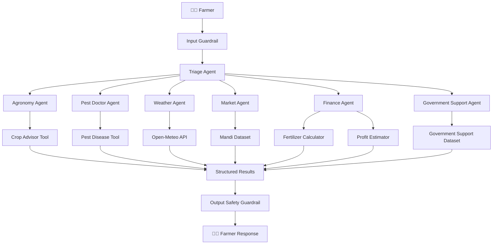

# 🌾 Kisan Dost

### An Agentic AI Farming Assistant for Pakistani Farmers

Kisan Dost is a **multi-agent Agentic AI agricultural assistant** designed to help Pakistani farmers make better farming decisions through natural-language interaction.

The system uses a central **Triage Agent** to understand a farmer's request and route it to a specialized agricultural agent. Each specialist can use dedicated tools, structured data models, controlled datasets, external APIs, and safety guardrails to produce reliable and practical responses.

Kisan Dost currently focuses on:

- 🌱 Crop Recommendation
- 🐛 Pest & Disease Diagnosis
- 🧪 Fertilizer Calculation
- 🌦️ Weather & Irrigation Information
- 📈 Mandi Price Lookup
- 💰 Profit & Break-Even Estimation
- 🏛️ Government Agricultural Support

The project demonstrates practical implementation of **Agentic AI concepts using the OpenAI Agents SDK**, with model inference configured through Groq's OpenAI-compatible API.

---

## 📑 Table of Contents

- [Overview](#-overview)
- [Problem](#-problem)
- [Solution](#-solution)
- [Key Features](#-key-features)
- [System Architecture](#-system-architecture)
- [Agent Architecture](#-agent-architecture)
- [Agents](#-agents)
- [Tools](#-tools)
- [Context Management](#-context-management)
- [Session Memory](#-session-memory)
- [Guardrails & Safety](#-guardrails--safety)
- [Structured Outputs](#-structured-outputs)
- [Data Sources](#-data-sources)
- [Technology Stack](#-technology-stack)
- [Project Structure](#-project-structure)
- [Installation](#-installation)
- [Configuration](#-configuration)
- [Running the Application](#-running-the-application)
- [Example Workflow](#-example-workflow)
- [OpenAI Agents SDK Concepts](#-openai-agents-sdk-concepts)
- [Testing Checklist](#-testing-checklist)
- [Safety Considerations](#-safety-considerations)
- [Current Limitations](#-current-limitations)
- [Future Roadmap](#-future-roadmap)
- [Security](#-security)
- [Project Philosophy](#-project-philosophy)

---

# 🌾 Overview

Agricultural decisions often require farmers to consider multiple factors simultaneously:

- Which crop is suitable?
- How much fertilizer is required?
- What is the expected profit?
- What is the current weather?
- What is the mandi price?
- Is there a government subsidy?
- What pest or disease may be affecting the crop?

Instead of building one large chatbot responsible for every agricultural problem, **Kisan Dost uses specialized AI agents**, each responsible for a specific domain.

The architecture separates:

> **Intent Understanding → Agent Routing → Specialist Reasoning → Tool Execution → Structured Data → Safety Validation → Farmer Response**

This makes the system modular, easier to extend, and better suited for demonstrating real Agentic AI behavior.

---

# ❗ Problem

Farmers frequently need information from multiple agricultural domains.

A single question may require:

- agricultural knowledge,
- mathematical calculations,
- external weather information,
- market information,
- government-program information,
- and safety-aware pesticide guidance.

A conventional chatbot architecture would typically look like:

```text
Farmer
   ↓
LLM
   ↓
Answer

```

This approach can make it difficult to:

- separate responsibilities,
- guarantee deterministic calculations,
- control sensitive outputs,
- integrate multiple tools,
- maintain trusted farmer information,
- and scale the system with additional capabilities.

---

# 💡 Solution

Kisan Dost introduces a **multi-agent architecture**.

```text
Farmer
   ↓
Input Guardrail
   ↓
Triage Agent
   ↓
Specialist Agent
   ↓
Function Tool / API / Controlled Data
   ↓
Structured Result
   ↓
Output Safety Guardrail
   ↓
Farmer

```

The Triage Agent determines the farmer's intent and performs a handoff to exactly one specialist.

For example:

```text
"Rabi mein kaunsi crop lagaoon?"
            ↓
      Triage Agent
            ↓
      Agronomy Agent
            ↓
      Crop Advisor Tool

```

While:

```text
"Fertilizer subsidy mil sakti hai?"
            ↓
      Triage Agent
            ↓
 Government Support Agent
            ↓
 Government Support Tool

```

This separation allows Kisan Dost to combine LLM reasoning with deterministic application logic and external data.

---

# ✨ Key Features

## 🌱 Crop Recommendation

The Agronomy Agent can recommend suitable crops based on the farmer's:

- district,
- soil type,
- season,
- water availability,
- and farming context.

Crop recommendations are generated through the controlled `crop_advisor` tool.

---

## 🧪 Fertilizer Calculator

The Finance Agent provides fertilizer calculations for supported crops.

Currently the system handles:

- DAP
- Urea

The calculator determines:

- bags per acre,
- total bags,
- price per bag,
- total fertilizer cost.

The calculations are performed by deterministic Python logic instead of asking the LLM to perform the mathematical calculation itself.

---

## 💰 Profit Estimation

The Finance Agent can estimate:

- total revenue,
- total farming cost,
- net profit,
- break-even yield.

The calculation uses controlled crop-economic data and farmer acreage from the application context.

---

## 🌦️ Weather Information

The Weather Agent integrates with **Open-Meteo** to retrieve external weather information.

The weather tool can provide:

- current temperature,
- humidity,
- wind speed,
- precipitation,
- daily maximum temperature,
- daily minimum temperature,
- precipitation probability.

This allows weather information to come from an external weather API rather than being invented by the language model.

---

## 🐛 Pest & Disease Diagnosis

The Pest Doctor Agent analyzes farmer-provided crop symptoms.

The system supports:

- possible pest/disease identification,
- symptoms,
- treatment guidance,
- safety notes.

The project intentionally avoids inventing pesticide dosages when verified dosage information is unavailable.

---

## 📈 Mandi Price Lookup

The Market Agent can retrieve crop prices from the controlled mandi dataset.

Supported examples include:

- Wheat
- Chickpea
- Maize

The current implementation uses a **controlled/demo dataset** and should not be interpreted as guaranteed live market pricing.

---

## 🏛️ Government Support Finder

The Government Support Agent can search agricultural support programs based on:

- farmer province,
- support requirement,
- program type,
- benefit information.

The farmer's province is obtained from the trusted `FarmerProfile` context.

Government-support information in the current implementation is based on controlled/demo data and should be verified against official sources before real-world use.

---

# 🏗️ System Architecture



---

# 🤖 Agent Architecture

## Triage Agent

**Purpose:** Understand farmer intent and route to specialists.

**Responsibilities:**

- Parse farmer query
- Classify request intent
- Perform handoff to appropriate specialist
- Provide default response for non-agricultural requests

**Example:**

```
Farmer: "Meri cotton mein kaun si bimari hai?"
Triage: → Pest Doctor Agent
```

---

## Agronomy Agent

**Purpose:** Provide crop advisory and agricultural recommendations.

**Capabilities:**

- crop_advisor: Recommend crops for given district, season, soil type
- Provides region-specific agricultural guidance

**Example:**

```
Farmer: "Rabi season mein Faisalabad mein kaunsi crop lagaoon?"
Agronomy: → Calls crop_advisor tool → Returns 3-5 crop recommendations
```

---

## Pest Doctor Agent

**Purpose:** Diagnose pests and diseases from symptoms.

**Capabilities:**

- pest_disease_tool: Identify pest/disease from symptoms
- Provides treatment recommendations
- Includes safety guardrails for pesticide information

**Example:**

```
Farmer: "Meri crop par yellow spots hain"
Pest Doctor: → Calls pest_disease_tool → Provides diagnosis and treatment
```

---

## Weather Agent

**Purpose:** Provide weather information via external API.

**Capabilities:**

- weather_tool: Fetch current and forecast weather
- Integrates with Open-Meteo API
- Returns temperature, humidity, precipitation, wind speed

**Example:**

```
Farmer: "Aaj kaisa weather hai Lahore mein?"
Weather: → Calls weather_tool → Returns current conditions
```

---

## Market Agent

**Purpose:** Provide mandi prices for crops.

**Capabilities:**

- market_tool: Lookup crop prices from controlled dataset
- Returns current mandi rates
- Supports wheat, chickpea, maize, and other crops

**Example:**

```
Farmer: "Wheat ka mandi price kya hai?"
Market: → Calls market_tool → Returns price data
```

---

## Finance Agent

**Purpose:** Provide financial calculations for farming operations.

**Capabilities:**

- fertilizer_calculator: Calculate fertilizer bags, cost
- profit_estimator: Estimate revenue, cost, profit
- Deterministic calculations based on established formulas

**Example:**

```
Farmer: "Mere 5 acre mein DAP kitna lagna hoga?"
Finance: → Calls fertilizer_calculator → Returns bags and cost
```

---

## Government Support Agent

**Purpose:** Help farmers find government agricultural programs.

**Capabilities:**

- government_support_tool: Search support programs by province
- Returns subsidy information, eligibility, benefits
- Based on controlled/demo dataset

**Example:**

```
Farmer: "Punjab mein fertilizer subsidy mil sakti hai?"
Government Support: → Calls government_support_tool → Returns program info
```

---

# 🧩 Tools

The application uses **function tools** to implement agent capabilities.

Each agent calls one or more function tools through the OpenAI Agents framework:

| Tool | Agent | Purpose |
| --- | --- | --- |
| `crop_advisor` | Agronomy | Recommend crops by district/season/soil |
| `pest_disease_tool` | Pest Doctor | Diagnose pest/disease from symptoms |
| `weather_tool` | Weather | Fetch weather data via Open-Meteo API |
| `market_tool` | Market | Lookup mandi prices |
| `fertilizer_calculator` | Finance | Calculate fertilizer requirement |
| `profit_estimator` | Finance | Estimate farming profit |
| `government_support_tool` | Government Support | Find govt programs by province |

---

# 📋 Context Management

The application uses **RunContextWrapper** to provide farmer profile context to all tools.

### FarmerProfile

```python
class FarmerProfile:
    name: str
    province: str
    district: str
    acreage: float
    soil_type: str
```

This context is stored in `RunContext` and is available to all tool functions.

**Benefit:** Tools can reference farmer information without asking the farmer to repeat it.

---

# 💾 Session Memory

The application uses **SQLiteSession** to maintain conversation history.

### Database Table

| Column | Purpose |
| --- | --- |
| `message_id` | Unique identifier |
| `timestamp` | When message was sent |
| `sender` | Who sent it (farmer/agent) |
| `content` | Message text |
| `agent_name` | Which agent processed it |

### Usage

```python
session = SQLiteSession(db_path="farmer_conversations.db")
session.add_message(sender="farmer", content="Query", agent_name="Triage")
history = session.get_history(limit=10)
```

---

# 🛡️ Guardrails & Safety

Kisan Dost implements **input and output guardrails** to ensure safe and appropriate responses.

### Input Guardrail

Prevents non-agricultural queries:

```
✅ Allowed: "Meri wheat mein pest hai"
❌ Blocked: "Mujhe coding sikhao"
```

### Output Guardrails

Prevent unsafe responses:

1. **Pesticide Safety:** Does not invent dosages
2. **Medical Claims:** Does not provide human medical advice
3. **Guaranteed Benefits:** Does not guarantee subsidy approval
4. **Currency Validation:** Validates financial figures

---

# 📊 Structured Outputs

All agent responses use **Pydantic models** for structured, predictable output.

### Example: Crop Recommendation

```python
class CropRecommendation(BaseModel):
    crop_name: str
    suitability_score: float  # 0-1
    season: str
    water_requirement: str
    expected_yield: str
    market_demand: str
    government_support: Optional[str]
```

### Benefits

- Type safety
- API-friendly JSON
- Validated responses
- Consistent farmer experience

---

# 📚 Data Sources

### Controlled Agricultural Dataset

- Crops by district and season
- Crop water requirements
- Expected yields
- Economic data (costs, prices)

### Controlled Pest/Disease Dataset

- Common pests and diseases
- Symptoms
- Treatment methods
- Safety information

### Mandi Prices (Demo)

- Wheat, chickpea, maize, cotton
- Base prices (not live market)
- Should be replaced with live API in production

### Government Support (Demo)

- Provincial subsidies
- Eligibility criteria
- Benefit amounts
- Contact information

---

# 🛠️ Technology Stack

| Component | Technology |
| --- | --- |
| **Language** | Python 3.10+ |
| **LLM Framework** | OpenAI Agents SDK |
| **Model Provider** | Groq (OpenAI-compatible API) |
| **Data Validation** | Pydantic v2 |
| **Session Storage** | SQLite |
| **Weather API** | Open-Meteo (free, no key required) |
| **Deployment** | Terminal / CLI |

---

# 📁 Project Structure

```
kisan-dost/
├── README.md
├── requirements.txt
├── .env.example
├── .gitignore
│
├── main.py                 # Entry point
├── config.py               # Configuration
│
├── core/
│   ├── __init__.py
│   ├── triage_agent.py     # Triage agent definition
│   ├── agents/
│   │   ├── agronomy.py
│   │   ├── pest_doctor.py
│   │   ├── weather.py
│   │   ├── market.py
│   │   ├── finance.py
│   │   └── government_support.py
│   │
│   └── tools/
│       ├── __init__.py
│       ├── crop_advisor.py
│       ├── pest_disease.py
│       ├── weather_tool.py
│       ├── market_tool.py
│       ├── fertilizer_calculator.py
│       ├── profit_estimator.py
│       └── government_support_tool.py
│
├── models/
│   ├── __init__.py
│   ├── farmer_profile.py    # FarmerProfile Pydantic model
│   ├── responses.py         # Response Pydantic models
│   └── data_models.py       # Data validation models
│
├── context/
│   ├── __init__.py
│   ├── run_context.py       # RunContextWrapper
│   └── farmer_context.py    # Farmer information storage
│
├── safety/
│   ├── __init__.py
│   ├── input_guardrail.py   # Input validation
│   └── output_guardrail.py  # Output safety checks
│
├── storage/
│   ├── __init__.py
│   ├── sqlite_session.py    # Session memory
│   └── data/
│       ├── crops.json       # Crop database
│       ├── pests.json       # Pest/disease database
│       ├── mandi.json       # Mandi price dataset
│       └── government_programs.json
│
└── utils/
    ├── __init__.py
    └── helpers.py           # Utility functions
```

---

# 🚀 Installation

### Prerequisites

- Python 3.10 or higher
- pip (Python package manager)
- Git

### Steps

1. **Clone the repository:**

```bash
git clone https://github.com/<YOUR_USERNAME>/kisan-dost.git
cd kisan-dost
```

2. **Create a virtual environment:**

```bash
python -m venv venv
source venv/bin/activate  # On Windows: venv\Scripts\activate
```

3. **Install dependencies:**

```bash
pip install -r requirements.txt
```

4. **Set up environment variables:**

```bash
cp .env.example .env
```

Edit `.env` and add your API keys:

```
GROQ_API_KEY=your_groq_api_key_here
```

---

# ⚙️ Configuration

### .env File

```
# Groq API Configuration
GROQ_API_KEY=gsk_...your_key_here...

# Model Configuration
MODEL_NAME=llama-3.1-70b-versatile
TEMPERATURE=0.7
MAX_TOKENS=1000

# Database
DATABASE_PATH=./data/conversations.db

# Logging
LOG_LEVEL=INFO
```

### config.py

```python
import os
from dotenv import load_dotenv

load_dotenv()

GROQ_API_KEY = os.getenv("GROQ_API_KEY")
MODEL_NAME = os.getenv("MODEL_NAME", "llama-3.1-70b-versatile")
TEMPERATURE = float(os.getenv("TEMPERATURE", "0.7"))
MAX_TOKENS = int(os.getenv("MAX_TOKENS", "1000"))
DATABASE_PATH = os.getenv("DATABASE_PATH", "./data/conversations.db")
```

---

# ▶️ Running the Application

### Start the CLI

```bash
python main.py
```

### Example Interaction

```
🌾 Kisan Dost - Agricultural Assistant
======================================

👨‍🌾 Farmer: Meri cotton mein yellow spots hain

🤖 Triage: Samajh gaya. Pest Doctor se milata hoon.

🐛 Pest Doctor: Symptoms dekh raha hoon...

Possible Diagnosis: Bacterial Blight
- Symptoms: Yellow spots, leaf yellowing
- Treatment: Use resistant varieties, bacterial fungicide
- ⚠️ Safety: Consult local agricultural officer for dosage

👨‍🌾 Farmer: Shukriya!
```

---

# 📖 Example Workflow

## Scenario: Farmer asks for crop recommendation

```
Farmer: "Rabi mein Punjab mein kaunsi crop lagaoon? Mera soil loamy hai."

1. Input Guardrail ✅ (Agricultural query allowed)

2. Triage Agent
   - Parses: Rabi season, Punjab province, crop recommendation
   - Routes: → Agronomy Agent

3. Agronomy Agent
   - Calls: crop_advisor(province="Punjab", season="Rabi", soil="loamy")
   
4. crop_advisor Tool
   - Returns: [Wheat (score: 0.95), Chickpea (0.87), Barley (0.79)]

5. Structure
   - Formats response as: CropRecommendation Pydantic model

6. Output Guardrail ✅
   - Validates: No unsupported claims, proper formatting

7. Response to Farmer
   "Aap ke liye best hain: Wheat (95%), Chickpea (87%), Barley (79%)"
```

---

# 🤖 OpenAI Agents SDK Concepts

Kisan Dost uses several key concepts from the OpenAI Agents SDK:

| Concept | Usage | Purpose |
| --- | --- | --- |
| `Agent` | Creates Triage and specialist agents | Represents autonomous agents |
| `Runner` | Executes agent runs | Processes requests through agents |
| `Function Tools` | Connect agents to Python logic | Agents can call Python functions |
| `Handoffs` | Routes between agents | Triage → Specialists |
| `RunContextWrapper` | Provides farmer context to tools | Access shared farmer data |
| `Context` | Stores trusted farmer information | Central data store |
| `SQLiteSession` | Maintains conversation history | Session memory |
| `Input Guardrails` | Restrict requests to agriculture | Safety layer |
| `Output Guardrails` | Validate final responses | Response safety |
| `Pydantic` | Defines structured data models | Type-safe outputs |
| `ModelSettings` | Controls model behavior | LLM configuration |

---

# 🧪 Testing Checklist

## Input Guardrail

-  Agriculture query is allowed
-  Crop query is allowed
-  Fertilizer query is allowed
-  Weather query is allowed
-  Subsidy query is allowed
-  Clearly unrelated query is blocked

## Agent Routing

-  Crop → Agronomy
-  Weather → Weather
-  Pest → Pest Doctor
-  Mandi → Market
-  Fertilizer → Finance
-  Profit → Finance
-  Subsidy → Government Support

## Tools

-  Crop advisor
-  Fertilizer calculator
-  Profit estimator
-  Weather API
-  Mandi lookup
-  Pest diagnosis
-  Government support

## Safety

-  Unsupported pesticide dosage protection
-  Human medical advice protection
-  Unsupported currency protection
-  Guaranteed subsidy claim protection

---

# ⚠️ Current Limitations

Kisan Dost is currently a prototype/demo implementation.

Current limitations include:

- Terminal-based interface
- Controlled/demo agricultural datasets
- Controlled/demo mandi prices
- Controlled/demo government support information
- Limited crop dataset
- Limited pest/disease dataset
- External dependency on Open-Meteo for weather information
- No production authentication system
- No production-grade database
- No dedicated mobile application

These limitations define the current scope of the project and provide opportunities for future development.

---

# 🚀 Future Roadmap

Potential future improvements include:

## 🌐 User Experience

- Web application
- Mobile application
- Responsive farmer dashboard
- Urdu-first interface

## 🎙️ Multimodal Interaction

- Voice-based farmer interaction
- Urdu speech recognition
- Text-to-speech
- Image-based crop diagnosis

## 📊 Agricultural Intelligence

- Larger crop database
- Soil analysis
- Historical farming analytics
- Satellite data
- Advanced weather intelligence
- Crop disease image recognition

## 📈 Live Data

- Live mandi prices
- Official government-program APIs
- Agricultural market intelligence
- Real-time alerts

## 👨‍🌾 Expert Escalation

Future versions could allow complex cases to be escalated to qualified agriculture officers or experts.

## 🏭 Production Infrastructure

- Authentication
- Production database
- Monitoring
- Observability
- Scalable deployment
- Notification services

---

# 🔐 Security

Kisan Dost follows basic security practices:

- API credentials are stored in environment variables.
- `.env` should not be committed.
- API keys should never be hard-coded.
- `.env.example` should contain placeholders only.
- Tool inputs are validated.
- Agricultural calculations are performed through deterministic logic.
- Safety guardrails validate final responses.

---

# 🧠 Project Philosophy

Kisan Dost is built around a simple principle:

> **Let the AI understand the farmer. Let specialized agents handle the domain. Let tools handle the facts and calculations. Let guardrails protect the output.**

The architecture can be summarized as:

```text
Understand
    ↓
Route
    ↓
Specialize
    ↓
Use Tools
    ↓
Structure Data
    ↓
Validate
    ↓
Respond

```

This approach demonstrates how Agentic AI can move beyond a basic question-answer chatbot toward a system capable of coordinating multiple specialized capabilities.

---

# 🌾 Why Kisan Dost?

Agriculture is a domain where decisions can directly affect:

- crop production,
- farming expenses,
- water usage,
- pest management,
- market decisions,
- and farmer income.

Kisan Dost demonstrates how an Agentic AI architecture can bring several of these workflows together through a single natural-language interface.

The project combines:

```text
Multi-Agent Architecture
        +
Function Tools
        +
External API
        +
Deterministic Calculations
        +
Structured Outputs
        +
Context
        +
Session Memory
        +
Guardrails

```

into one practical agricultural assistant.

---

# 📌 Project Status

**Status:** Functional Agentic AI Prototype

**Interface:** Terminal / CLI

**Primary Language:** Python

**Architecture:** Multi-Agent

**Model Provider:** Groq OpenAI-compatible API

**Agent Framework:** OpenAI Agents SDK

**Domain:** Agriculture / AgriTech

**Target Users:** Pakistani Farmers

---

# 👨‍💻 Built With

Built as an Agentic AI project demonstrating practical multi-agent orchestration, tool calling, context management, session memory, structured outputs, guardrails, deterministic business logic, and external API integration for an agricultural use case.

---

## 🌱 Kisan Dost

**Understand the farmer. Route intelligently. Use reliable tools. Respond safely.**
